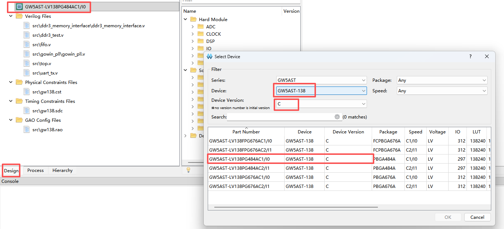

  在 Gowin EDA（高云集成开发环境）中，中更改目标器件（Device）及版本是项目迁移中的常见操作。，可以按照以下步骤进行操作：
  
  
  
  ---
  
  
  #### **1. 进入器件配置界面**
  在 IDE 左侧的 **Design** 窗口中，找到最顶层的项目节点。双击带有 **绿色芯片图标** 的那一栏（该行通常显示当前的芯片完整型号，例如 `GW5AST-LV138...`）。
  
  #### **2. 选择新器件**
  在弹出的 **Device Selection** 窗口中：
  * **Series/Device：** 选择目标芯片系列及具体型号。
  * **Package/Speed：** 确认封装形式和速度等级。
  * 确认无误后点击 **OK**。此时项目会自动关联新器件的库文件。
  
  #### **3. [重新配置并生成 IP 核（关键步骤）](./how_to_regenerate_IP.zh.md)**
  由于不同型号的芯片架构（如 PLL、存储单元、SerDes）可能存在差异，**必须手动刷新 IP**。
  
  #### **4. 重新执行设计流程**
  完成硬件更换和 IP 刷新后，需要依次重新运行：
  1.  **Synthesize** (综合)
  2.  **Place & Route** (布线)
  3.  **Produce Device Video/Bitstream** (生成固件)
  
  ---
  
  ### **注意事项**
  * **兼容性检查：** 部分型号芯片支持的 IP 在其他系列（如从 GW2A 迁移到 GW5A）中可能已被弃用或同类替换，务必核对 IP 是否存在。
  * **管脚约束：** 更改器件后，物理引脚定义（`.cst` 文件）通常会失效或需要调整，请务必在 **FloorPlanner** 中重新检查引脚分配。