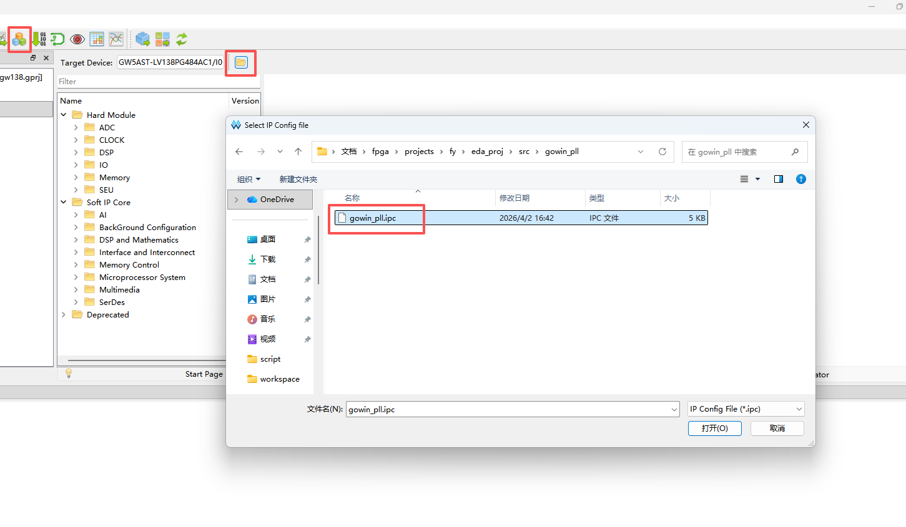

In the Gowin EDA (Gowin Integrated Development Environment), if you need to modify the parameters of an existing IP core or regenerate the relevant files, you can follow these steps:

### **Guide to Regenerating/Modifying Gowin IP Cores**

1. **Launch the IP Tool**
    In the Gowin EDA main interface toolbar, click the **IP Core Generator** icon (usually represented by **an icon of three overlapping colored squares**).

2. **Import the Configuration File**
    In the IP Core Generator window, click the **Open Config File** icon (a **yellow folder/archive** icon) on the toolbar.

3. **Select the Target File**
    In the file browser, navigate to the folder in your project where the IP is stored. Select the configuration file with the **`.ipc`** (IP Configuration) extension and open it.
    **Note**: This file stores all the parameters you previously configured.

4. **Modify and Regenerate**
    * **Modify Parameters:** The IP configuration interface will appear. You can now adjust parameters such as frequency, bit width, etc., as needed.
    * **Generate Files:** Click the OK button at the bottom of the interface. The IDE will automatically update the relevant Verilog/VHDL source code and constraint files.